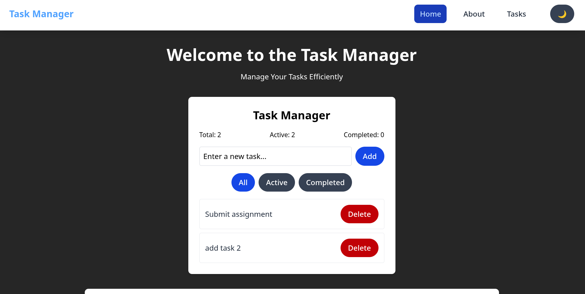
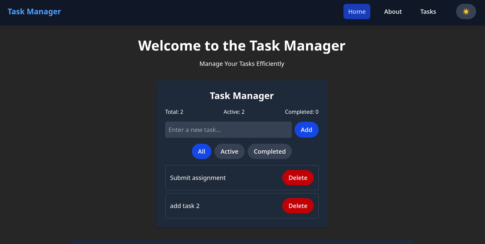
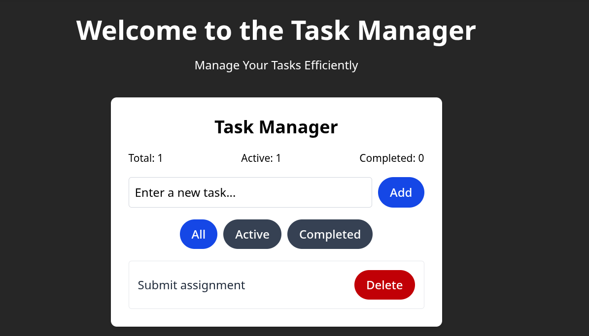
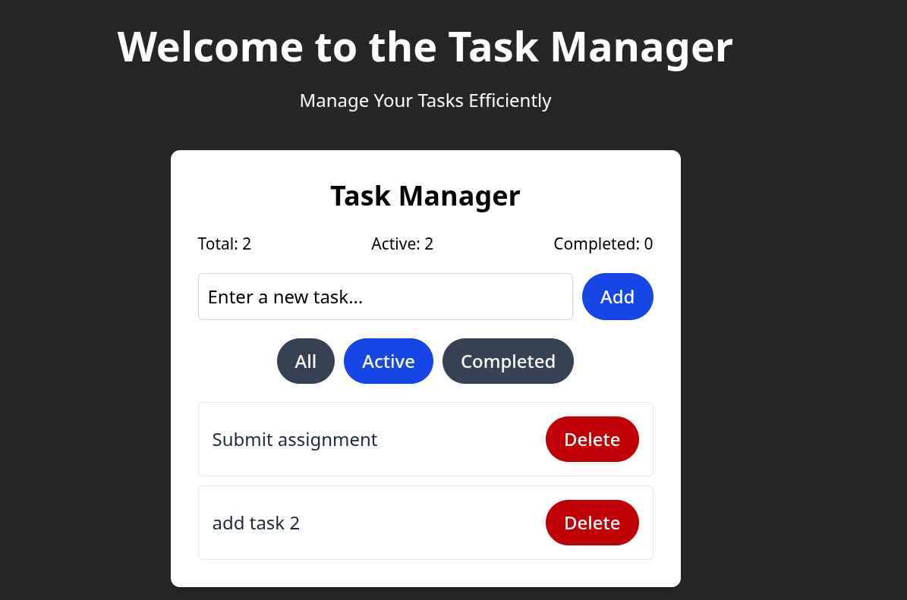
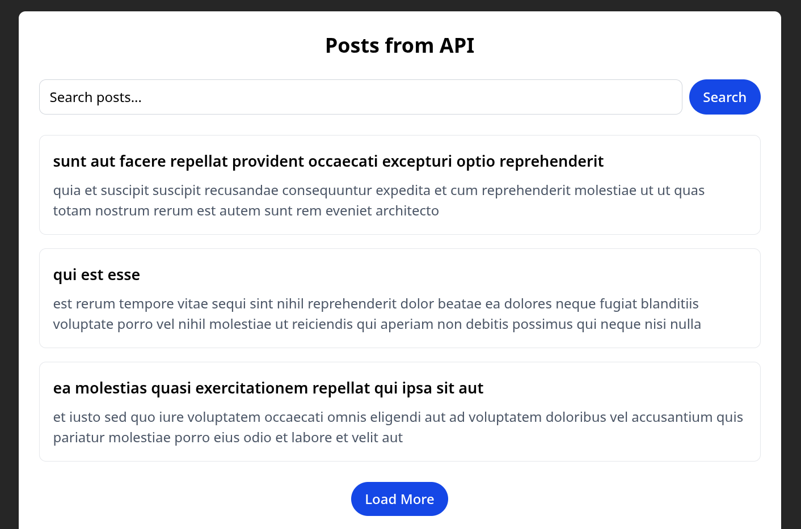

# Week 3: PLP Assignment
# Sarota Raphael

A modern React application demonstrating component architecture, state management, hooks usage, and API integration.

##  Live Demo

[https://taskmanager-kohl-pi.vercel.app/](https://taskmanager-kohl-pi.vercel.app/)

---

##  Screenshots

###  Light Mode Interface

Clean light theme with modern UI design.

###  Dark Mode Interface

Elegant dark theme for comfortable viewing.

###  Task Management

Adding new tasks with the input form.


Viewing and managing active tasks.

###  API Integration

Displaying posts fetched from JSONPlaceholder API.

---

##  Features

-  **Built with Vite** – Fast development and builds  
-  **Tailwind CSS** – Utility-first styling with dark mode  
-  **Dark/Light Theme** – Toggle between themes with context API  
-  **Fully Responsive** – Works on mobile, tablet, and desktop  
-  **Task Manager** – Add, complete, delete, and filter tasks  
-  **Local Storage** – Tasks persist between sessions  
-  **API Integration** – Fetch and display posts from JSONPlaceholder  
-  **Search & Pagination** – Search posts and load more functionality  
-  **Component Architecture** – Reusable and modular components  
-  **React Router** – Client-side routing between pages  

---

## Tech Stack

- **Frontend Framework**: React 
- **Build Tool**: Vite  
- **Styling**: Tailwind CSS  
- **Routing**: React Router  
- **Icons**: Heroicons (React Icons)  
- **Deployment**: Vercel 
---

##  Project Structure

```

src/
├── components/
│   ├── ui/
│   │   ├── Button.jsx          # Reusable button component
│   │   └── Card.jsx            # Card layout component
│   ├── layout/
│   │   ├── Layout.jsx          # Main layout wrapper
│   │   ├── Navbar.jsx          # Navigation with mobile menu
│   │   └── Footer.jsx          # Footer component
│   ├── TaskManager.jsx         # Task management functionality
│   └── Posts.jsx               # API integration component
├── pages/
│   ├── Home.jsx                # Homepage with all components
│   └── About.jsx               # About page
├── context/
│   └── ThemeContext.jsx        # Dark/light theme management
├── hooks/
│   └── useLocalStorage.js      # Custom hook for localStorage
├── assets/
│   ├── activetasks.png         # Screenshot - active tasks view
│   ├── addtask.png             # Screenshot - add task interface
│   ├── apiposts.png            # Screenshot - API posts display
│   ├── darkmode.png            # Screenshot - dark theme
│   ├── lightmode.png           # Screenshot - light theme
│   └── react.svg               # React logo
├── App.jsx                     # Main app component with routing
└── main.jsx                    # App entry point

````

---

##  Getting Started

### Prerequisites

- Node.js (version 18 or higher recommended)
- npm or yarn package manager

### Installation

1. **Clone the repository**
   ```bash
   git clone https://github.com/PLP-MERN-Stack-Development/react-js-jsx-and-css-mastering-front-end-development-Topher254.git
   cd week3-react-project
````

2. **Install dependencies**

   ```bash
   npm install
   ```

3. **Start the development server**

   ```bash
   npm run dev
   ```

4. **Open your browser**
   Navigate to `http://localhost:5173`

---

### Available Scripts

* `npm run dev` - Start development server
